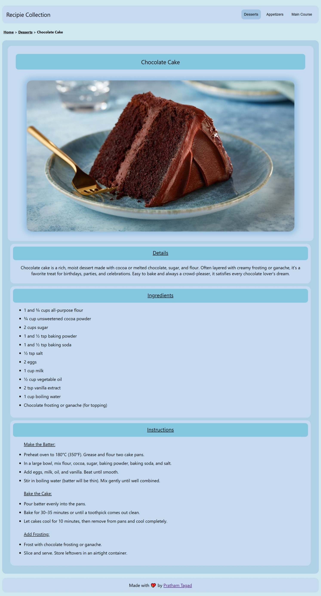
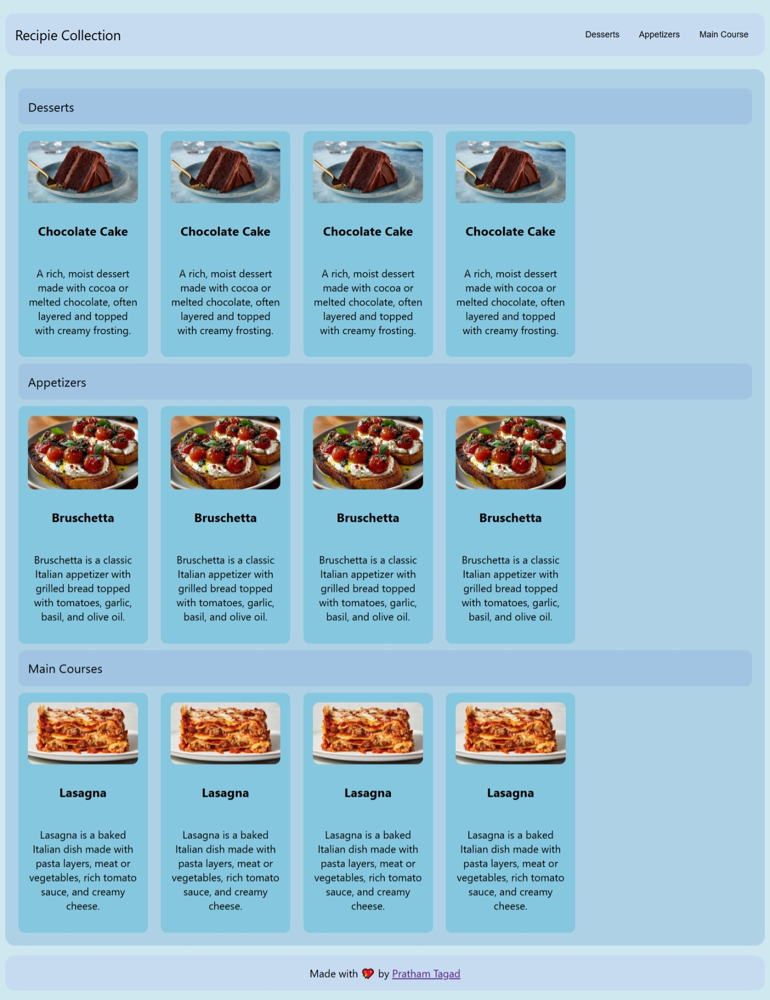

  

<h1 align="center">🍽️ Static Recipe Collection Website</h1>

  A simple and aesthetic static website to showcase categorized recipes like desserts, appetizers, and main courses. 

  
  
  
  

---

## 🖥️ Live Preview

> 🔗 [Check out the live site here!](https://your-live-site-link.com)

---

## 🚀 Features

- ✅ Clean, colorful UI with categories like desserts, appetizers, and main courses
- ✅ Responsive layout using pure HTML and CSS
- ✅ Easy-to-read recipe details with ingredients and steps
- ✅ Flexbox-based layout for responsive alignment
- ✅ Lightweight and fast-loading static site

---

## 🧰 Tech Stack

| Tech     | Usage               |
|----------|---------------------|
| **HTML** | Page structure       |
| **CSS**  | Styling and layout   |

100% vanilla. No JavaScript, no frameworks!

---

## 📁 Folder Structure

